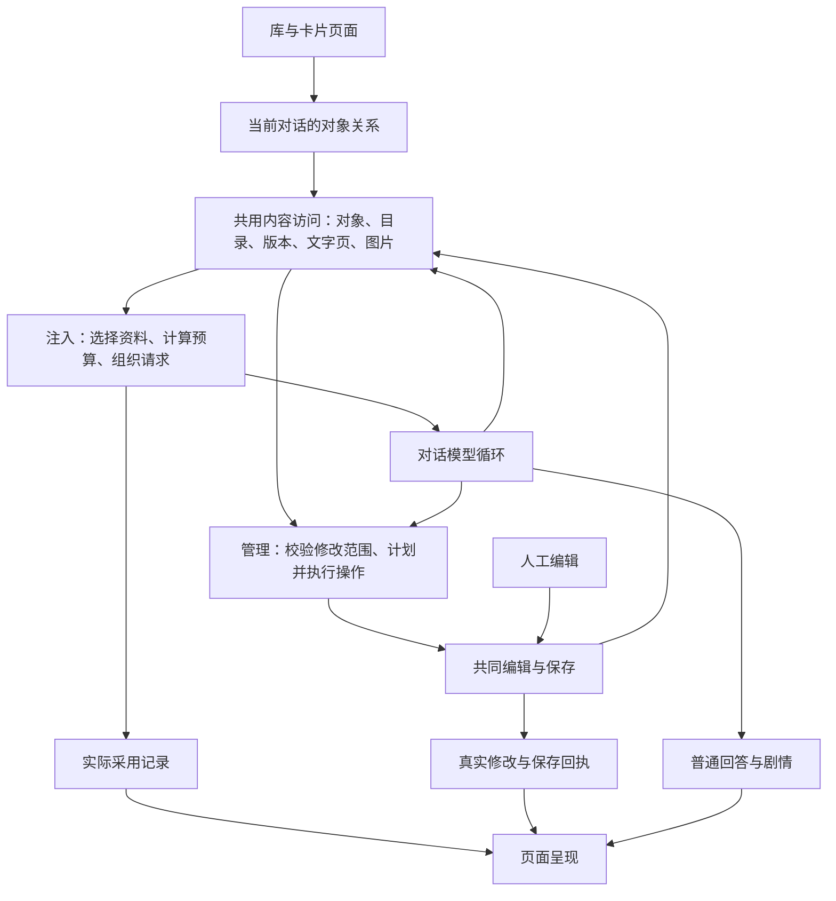

# 注入与管理：共用职责、修复与支线清单

本文件最初为下一阶段职责与工作清单；用户已确认开始执行。2026-09-11 实施进度与证据见 `docs/diagnostics/2026-09-11-shared-lines-execution.md`，本轮不公开发布。当前故障状态仍只以修复工作树的 `docs/diagnostics/3.0-bug-board.md` 为准；本文不是第二张故障表。

## 已确认的方向

保留原应用，新卡核心继续承担卡片业务。世界、角色共用模块化内容基础；不恢复独立文游卡，不重新开发已存在的编辑、存储与导入导出能力。

人工和 AI（人工智能）编辑共用修改与保存；注入和管理同样共用对象定位、内容目录、版本、分页读取与资源访问。共用能力不等于共用权限：采用不授予修改权，管理不强制全文注入、不改变回答身份。

卡片是持久内容，容量不等于模型单轮上下文容量。模型按需选择资料；同一模块反复触发不能重复累计注入。图片展示、模型看图、图片保存到卡片分别记账。对话状态与存档属于对话。

## 职责图

这是目标职责划分，不表示当前已经全部接通。当前断点主要在：选中资料至请求组织的大块全文读取；旧首页至新对象关系的分类；工具回执至用户可理解的过程展示。

## 共用什么，分别负责什么

| 职责 | 应复用的现有代码 | 边界与下一步 |
|---|---|---|
| 保存卡片、正文与资源 | CardStore（卡片存储）、内容文件存储、CardDrafts（卡片草稿） | 不为注入复制第二份持久正文；保留修订和用户原文 |
| 定位根卡、内部角色、模块和块 | ContentTargets（内容目标定位）、稳定编号 | 采用和管理使用相同定位规则；缺失对象明确返回，不偷偷新建或替换 |
| 读取结构、分页文字与图片 | CardToolReader（卡片工具读取）、TextPages（文字分页）、RequestMaterials（请求资料） | 消除注入接入处先全文读取的旁路；共用版本与分页位置，调用者权限分别检查 |
| 当前对话采用与管理关系 | CardBinding（卡片关联）、IntegratedCardSettings（卡片采用与管理设置） | 一个关系来源供首页、对话设置、工具范围读取；不能用管理关系判断回答身份 |
| 模块选择与请求预算 | ModuleAdoption（模块采用）、RequestMaterials（请求资料）、上下文预算规则 | 负责本轮需要什么、装得下什么、剩余如何读取；不得把选中等同全文已发送 |
| 执行修改 | CardToolCoordinator（卡片工具协调）、CardEditor（卡片编辑） | 复用版本、占用、保存及执行记录；不另写管理专用保存器 |
| 原应用对话宿主 | ChatViewModel（对话控制器） | 继续负责模型调用、消息与取消；内容规则由上述职责提供，不继续堆入宿主 |
| 用户显示 | 对话消息行、过程区域、卡片成果入口 | 读取实际记录；不根据同轮存在工具就折叠全部正文 |

现有接入入口主要位于 `src/android/app/src/main/java/com/openminis/app/cards/`；共用编辑与运行逻辑位于 `src/android/content-storage/`、`src/android/conversation-runtime/`。实施时先检查现有边界是否足用，再决定是否提取小模块，不能先造一堆空壳。

## 修复工作包与先后关系

### 一、请求能够启动：B89、B90

- 核对大块读取、模型容量、当前对话容量、历史占用、输出预留与卡片预算之间的真实关系。
- B89 已有代码证据：选料只看摘录，选中后整块全文读取并强制携带，超额直接拦截主回答。用现有分页能力补齐超大块的读取路径，不修改原卡结构来迁就请求。
- B90 目前是识别不一致反馈：分别核对上游元数据、型号别名、缓存、回退与界面限制。不得假设同品牌所有型号都有相同容量；未知容量不得冒充已验证百万窗口。
- 采用与管理同时开启时，管理请求仍可获得授权对象目录并启动；不依赖全文采用成功才让模型整理卡片。
- 资料记录区分选中、实际已带入、可继续读取、未读完，不能默默截断后宣称全部采用。
- 防止工具读取连续累积撑满后续请求，复用原对话压缩和卸载能力，避免另造第二套历史管理。

完成条件：大单模块、很多小模块、混合图片三种结构均能按实际预算处理；反复发送不重复塞历史副本；改变管理权限不会丢失或暗改采用关系。先代码复查，实施后的检查使用无害合成大文本，不复制用户敏感原文进测试仓库。

### 二、管理入口与连续工作

复用共同编辑，补的是前后衔接：选择真实对象 → 设置用途与范围 → 读取最新内容 → 操作 → 保存 → 打开同一对象。

| 支线 | 现有能力 | 要补或核对的连接 | 完成条件 |
|---|---|---|---|
| 用于已有对话 | 设置可保存互动、背景、管理关系 | 卡片入口与已有对话设置的目标选择统一 | 新对话与已有对话不产生第二张卡、不误切身份 |
| 人工草稿交接 | 交给 AI 前保存草稿 | 保存失败、未修改、目标是内部角色时的返回行为 | 最新内容确实保存才进入管理；失败保留输入 |
| 权限 | 原对话三档权限、内层对象校验 | 确认前后范围变化和错误反馈 | 只读无工具；批准勾选不执行；自由无重复批准 |
| 编辑占用 | 编辑句柄、版本冲突 | 用户查看、停止及恢复人工编辑的界面连接 | 停止后能继续；不能覆盖未识别新版本 |
| 中断与重试 | 执行记录、真实修订核对、草稿保留 | 将实际保存／未保存状态传到继续入口 | 不重复新建、不重做已保存操作、不谎报整任务完成 |
| 新建成果 | 保存回执、加入管理范围 | 成果按钮、库目录、内部角色归属一致 | 点击打开原对象，重进库仍可见 |

### 三、游玩及共用资源支线

| 支线 | 现有能力 | 要补或核对的连接 | 完成条件 |
|---|---|---|---|
| 世界及内部角色 | 内部角色可加入选料来源 | 选择与读取规则统一，保留来源 | 允许多人物叙述，不自动全文带入所有人 |
| 图片 | 卡片图片读取、对话图片归卡 | 当前消息可见范围、实际看图请求、归卡回执 | 展示不等于已看图；归卡成功后不依赖原附件 |
| 剧情插图 | 原生成链与图片目录仍在 | 生成、显示、模型看图、保存到指定对象逐段核对 | 每步失败有对应状态，不用“已执行”笼统代替 |
| 快捷操作 | register_controls（注册快捷操作）、点击发送／查看 | 保持两类卡共用、分支和重启后状态正确 | 行动按钮发送一次，查看按钮不推进剧情 |
| 对话状态 | 状态更新与分支读取 | 与新卡采用关系、重开对话的衔接 | 状态不写成卡片静态设定，重开不丢失 |
| 存档 | 保存、详情、原消息依据、后续资料读取 | 选档恢复的完整界面与语义尚不完整 | 保存与恢复分别证明；恢复不能依赖模型凭摘要重新编造 |
| 长对话 | 原压缩、停止与继续 | 新资料读取与已有历史预算协调 | 注入不能绕过预算，压缩不能删原始卡片内容 |

导入、导出、模块排序、图片归属属于共同内容能力，后两条线直接复用。只有发现真实连接缺口才修改，不重新实现这些功能。

### 四、过程与正文：B91、B06

工作过程应保留具体动作、来源对象、真实结果和失败；模型正常面向用户的说明不替换成“正在执行”。结束后可以收起过程，展开仍可回看。普通回答、剧情和人物对白继续作为正文。

先检查实际消息分段与工具回执，不能只凭关键词或“这一轮有工具”判断是否折叠。B06 本次属于待复查风险，尚未证实内容被删除；保留旧验证记录，不直接宣称复发已复现。

完成条件：同一轮同时有普通叙述、工具操作和最后回答时，各自保留；中断、失败、无最终回答时仍能找到已经产生的内容与操作结果。

### 五、首页入口与分类：B92、B93

当前代码确认：新建对话有效；从世界开始仅跳世界库；帮我创作仅新建对话并预填语句；列表尾部重复同组菜单。通用／设定按旧字段分类，不读取新卡关联。

建议收敛为清楚的新建对话入口，作品互动由卡片开始；是否删除分类还是改成实用筛选，属于待确认页面选择。无论页面如何选，数据判断只读当前实际关联，不能把管理等同采用。

## 尚不能当作已确认规则的选择

1. **必带内容装不下时如何处理。**不能自动把用户的必带降为摘要。普通自动选料可按需读取；真正必带超额需明确交互。只读模式没有读取工具，必须另行明确部分资料是否允许回答。
2. **预算比例。**现有 30% 和 128000 的卡片预算上限是代码现状，不是新确认产品要求。先核对总预算职责，不能简单删保护或统一改成百万。
3. **恢复存档的语义。**恢复消息位置、状态、采用关系与卡片历史版本的具体范围，需要先列清；不擅自覆盖当前进度，也不暗中实现已延期的分对话功能。
4. **既有对话选择入口与首页筛选的最终页面。**已确认需要减少重复和割裂，具体布局尚未确认，不借补支线扩展整套导航。

这些只影响对应工作包，不阻止共用内容读取、真实容量识别、失败诊断和过程分类的前置梳理。

## 执行与交付顺序

每个工作包开始前明确涉及的故障和支线，沿实际调用者确认范围。代码写完先逐段复查职责、调用和错误返回；随后按用户确认范围做针对性检查与编译，手机验收交用户。不得在尚未运行时声称通过。

优先顺序：共用访问与请求启动 → 管理连续工作 → 游玩资源和存档支线 → 正文与过程展示 → 首页入口。B90 容量证据核对、B91/B06 消息分类可以独立开展，不要求为次要页面先重写核心。

不改稳定工作树，不公开发布，不删除用户原始内容，不用文件数或测试数充当完成证明。当前候选九是此前菜单、拖动和文件夹工作的交付，不代表本文工作已完成。
